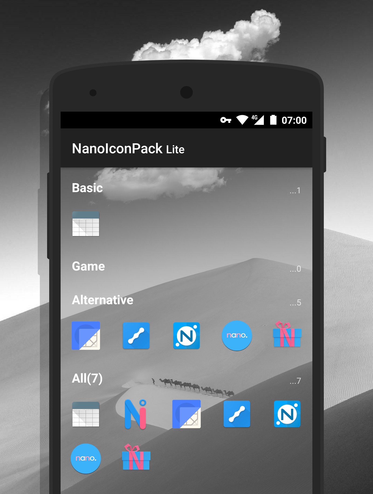

# NanoIconPack Lite

提供一个图标展示界面的简陋图标包APP模版。

### IDE兼容

**Android Studio**，没有问题。**[AIDE](https://play.google.com/store/apps/details?id=com.aide.ui)**？当然，也没有问题。

### 代码

核心代码全集中在一个 Activity 中：[LiteIconPack.java]()，这意味着你可以十分方便地把它融合到其他项目中使用。

### 参考

+ 图标包原理请移步：

  https://github.com/teslacoil/Example_NovaTheme

+ 功能更丰富的模版请移步：

  https://github.com/by-syk/NanoIconPack

### License

    Copyright 2017 By_syk

    Licensed under the Apache License, Version 2.0 (the "License");
    you may not use this file except in compliance with the License.
    You may obtain a copy of the License at

       http://www.apache.org/licenses/LICENSE-2.0

    Unless required by applicable law or agreed to in writing, software
    distributed under the License is distributed on an "AS IS" BASIS,
    WITHOUT WARRANTIES OR CONDITIONS OF ANY KIND, either express or implied.
    See the License for the specific language governing permissions and
    limitations under the License.

*Copyright &#169; 2017 By_syk. All rights reserved.*